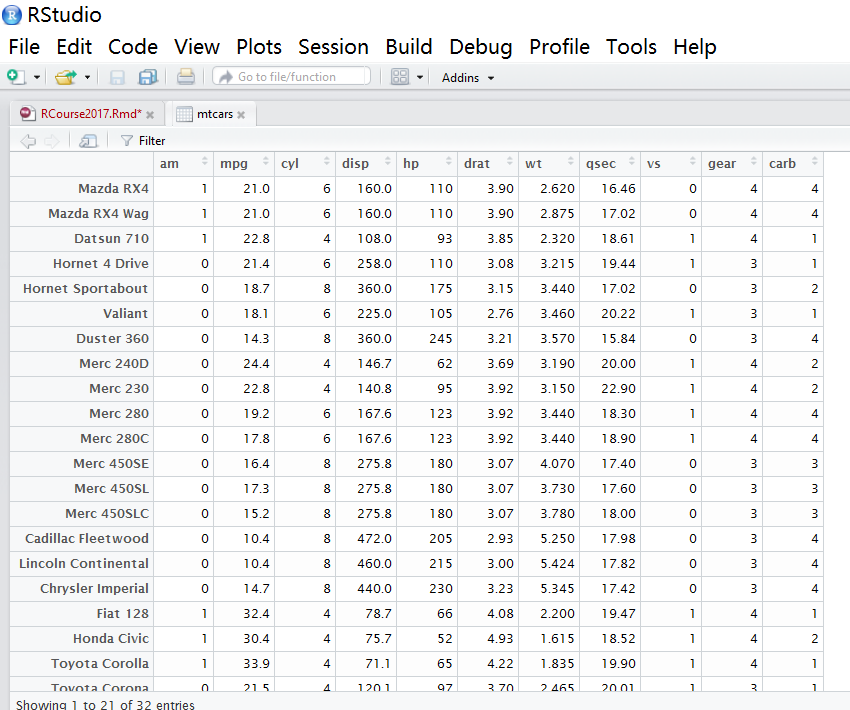

## RStudio 安装与设置

### RStudio 简介

R 虽然是个强大的统计分析软件，但仍欠缺完成数据分析的整体流程所需要的衍生功能。例如，如何满足普通用户对友好操作界面的需求，如何生成可重复、交互性的报告（Word 格式、HTML 格式或其他格式）并与他人共享，如何快速导入其他类型的数据（如 Excel、SPSS、Stata、SAS 等常用数据管理与分析软件格式的数据），等等。这就需要一个更具整合性的操作平台，以更有效率和对普通用户更友好的方式完成数据分析、报告撰写、成果发布等工作。

RStudio 就是一个优秀的 R 集成开发环境 ^[集成开发环境（Integrated Development Environment，IDE）软件是用于程序开发的应用程序，一般包括代码编辑器、编译器、调试器和图形用户界面工具，集成了代码编写、分析、编译、调试、建模等功能的一体化开发软件套。]。它集成了 R、带语法高亮和命令补全的代码编辑器、画图工具、代码调试工具等工作环境，同样提供 Windows、Mac 和 Linux 版本，同时具有免费的开源版本和付费的商业版本供用户选择。个人用户或普通用户选择免费版本即可，具有更高要求的企业用户或高级用户可选择商业版本。RStudio 的开发始于2010年，2011年2月发布测试版，2016年发布1.0.0版本。此后介绍均以 RStudio 1.0.0之后的版本为基础进行演示。

RStudio 的[核心团队](https://www.rstudio.com/about/)包括以首席科学家 [Hadley Wickham](http://hadley.nz/)为代表的其他数据科学家和软件工程师，他们是驱动 R 与数据科学进一步发展和推广的活跃力量，其所开发的诸多 R 包已成为数据分析的最常用工具。

RStudio 可从其[官网](https://www.rstudio.com/products/RStudio/)选择对应系统的版本下载安装。安装选择默认选项即可，注意一般应在安装完 R 后再安装 RStudio。

### RStudio 调试

此处应增加以下内容：

- RStudio四个窗口的布局与功能，要有截图，命名为pic-rstudio-overview.png
- RStudio新建文档的类型，要有截图，命名为pic-rstudio-newfile.png
- RStudio中`File --> Import Dataset`的功能与截图，命名为pic-rstudio-importdata.png
- RStudio中`Tools --> Check For Updates`的功能与截图，命名为pic-rstudio-update-package.png
- RStudio中`Tools --> Global Options --> Code --> Saving`下，Default text coding应选择为UTF-8，要有截图，命名为pic-rstudio-defalult-coding.png
- RStudio中`Help --> Cheatsheet (翻译为速查表) `的功能，以及`Help --> Markdown Quick Reference`的功能
- 其他你觉得重要的内容，要多百度下RStudio简介，以及相关的英文文档。研究透RStudio后，随时补充更新这一内容。
 
对初级用户而言，RStudio 的最初调试只涉及 Tools 菜单下的 Global Options 子菜单。（（**此处应插入一个光标停留Global Options路径下的截图，命名为pic-rstudio-global.png**））打开后，在 General 选项中可选择与 RStudio 相关联的 R 版本（如果只安装了一个版本的 R，此步骤可忽略），还可设定当前工作目录（working directory）。（（**此处应插入一个停留General路径下的截图，命名为pic-rstudio-general.png**））当前工作目录的设置非常重要，稍后继续说明。在 Appearance 选项中可选择字体、字号和背景颜色，可自行尝试调整到个人觉得舒适的配置。（**此处应插入一个停留Appearance路径下的截图，命名为pic-rstudio-appearance.png**）

**截图应只保留RStudio背景，不要露出Windows背景，保存为png格式，上传该截图文件至DAUR这个repo，在正文中写入类似`
`的文字，提交更新后即可看到图片。上传后，删除上面的说明文字。注意图片中的所有文件名字应为小写，与昨晚的截图不一样。**

### RStudio 功能简介

为确保能实现 RStudio 的诸多拓展功能，请确保已执行以下命令安装各相关包。

```r
install.packages(c("knitr", "rmarkdown", "bookdown", "xaringan", "shiny"))
```

其中，**knitr** 包和 **rmarkdown** 包可用来将 Rmarkdown 文档转为 HTML 网页、Word 文件或 PDF 文件；**bookdown** 包可用来撰写 Markdown 格式的长文档（书稿）并转为 HTML 网页、Word 文件或 PDF 文件；**xaringan** 可用来制作 HTML5 格式的网页幻灯片；**shiny** 包可用来制作交互式的网页。

安装完毕这些包后，打开 RStudio，点击左上角的新建空白文档图标的向下箭头，可以看到可供选择的新建文档格式包括 R script、R Notebook、R Markdown 等。一般可选择 R Markdown 为基本文档格式。以下如无特殊说明，均以此格式为准进行演示。

如想观察数据，可键入如下命令：
```r
View(mtcars)
```

此时左上方窗口会出现数据结构示意，并可执行数据排序（点击变量名称中的上下箭头按钮）、筛选（点沙漏形状的 Fitler 按钮）等简单功能。


### RStudio 中的常用快捷键

请补充，使用 Markdown 的表格形式。

